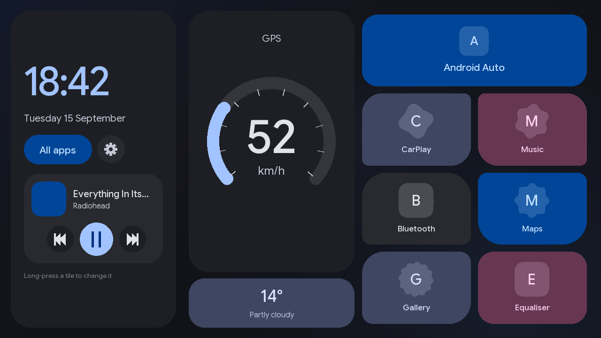
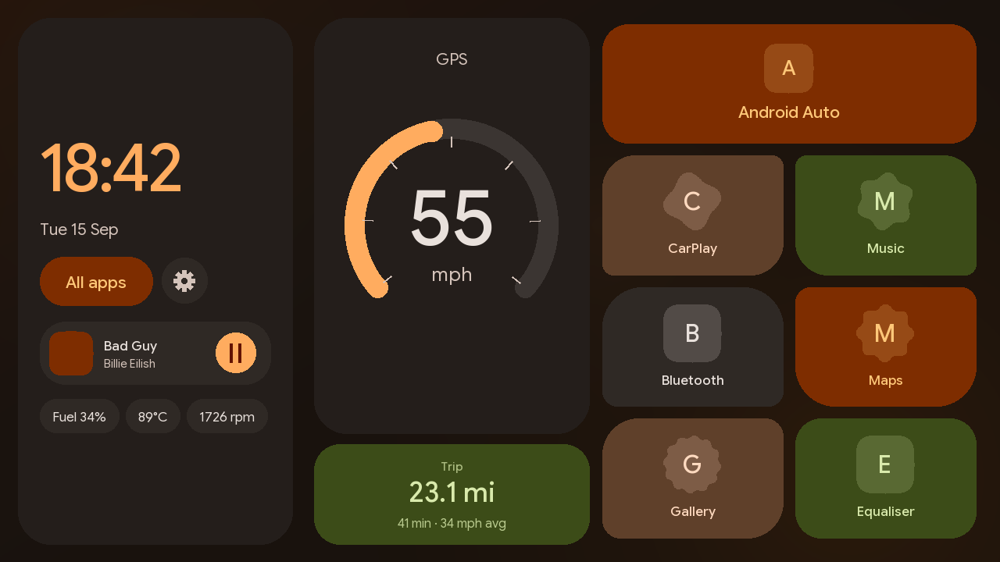
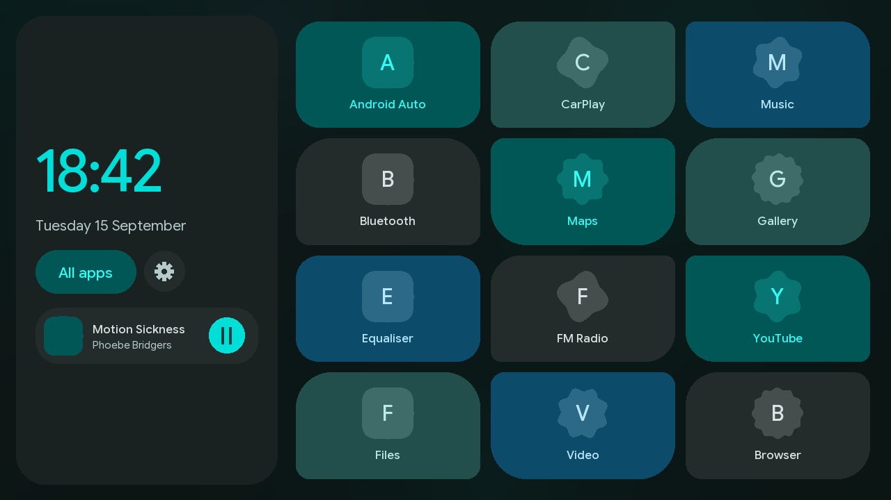
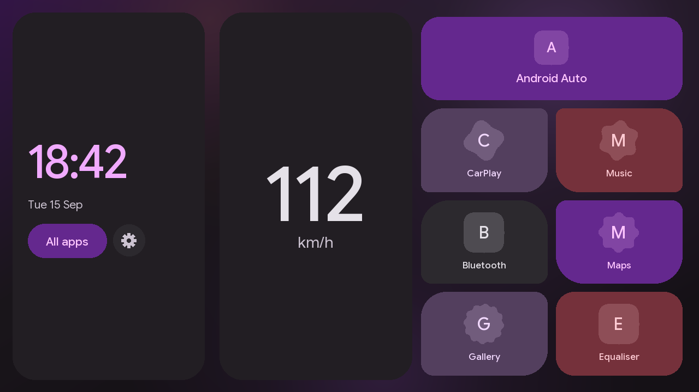
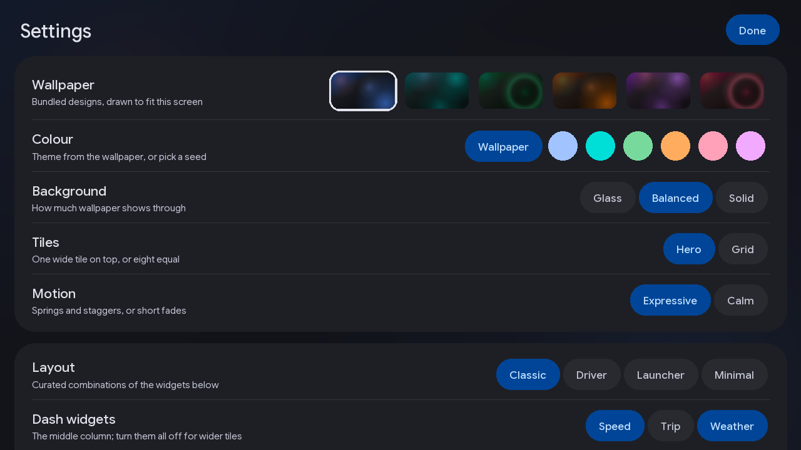
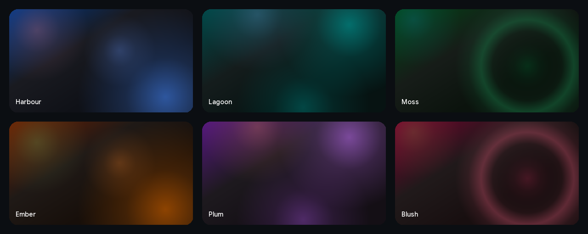

<p align="center">
  
</p>

<h1 align="center">CarDash</h1>

<p align="center">
  A Material 3 Expressive launcher for Android car head units.<br>
  Dynamic colour, a GPS dash, your music, your apps — on hardware that was never meant to have any of it.
</p>

<p align="center">
  <a href="https://github.com/dylanneve1/cardash/actions/workflows/ci.yml"></a>
  
  
  
</p>

---

## What it is

Aftermarket head units ship with launchers that look like 2012 and behave worse. CarDash replaces the home screen with something you'd actually want to glance at while driving:

- **Material You, generated on-device.** The whole palette is derived from your wallpaper — or from one of six bundled designs — so the clock, the gauge, the tiles and the controls all belong to one scheme. Works on Android 11, which never had dynamic colour.
- **A dash column that's yours.** A GPS speedometer, a trip meter, and the weather. Show the ones you want, or none and let the app grid take the room.
- **Now playing, without leaning over.** Whatever's playing — Bluetooth, Spotify, the radio app — appears under the clock with transport controls sized for a moving car.
- **Car data when there's a source.** Fuel, coolant, RPM and open doors from an ELM327 dongle or the unit's own CAN box. Nothing is shown until something real reports.
- **Expressive motion, or none.** Springs, staggers and crossfades tuned to Material 3's curves — or a *Calm* mode that swaps every one of them for a short fade.
- **Dark only.** A bright screen reflected in a windscreen at night is a hazard, not a preference.

## Presets

Four layouts that were designed as wholes, one tap each. Every individual widget can still be tuned underneath.

| | |
|:--:|:--:|
|  |  |
| **Classic** — speed and weather, full media, one wide tile | **Driver** — speed and trip, compact media, no clutter |
|  |  |
| **Launcher** — no dash column, twelve tiles | **Minimal** — clock, a number, tiles |

## Customise

Everything lives behind the gear next to *All apps*. Options are deliberately few and every combination has been looked at.

<p align="center">
  
</p>

| | |
|---|---|
| **Wallpaper** | Six bundled designs — *Harbour, Lagoon, Moss, Ember, Plum, Blush* — drawn to fit your screen. The theme follows. |
| **Colour** | From the wallpaper, or one of six seeds |
| **Background** | *Glass*, *Balanced* or *Solid* — how much wallpaper shows through |
| **Tiles** | One wide hero tile over the rest, or an even grid |
| **Motion** | *Expressive* or *Calm* |
| **Dash widgets** | Speed, Trip, Weather — any combination, including none |
| **Speed gauge** | Arc with ticks, or digits only; *City / Normal / Fast* scale |
| **Date, Now playing, Car data** | Full, compact or hidden |
| **Units** | km/h or mph, °C or °F, 12h or 24h |

<p align="center">
  
</p>

## Hardware

Built for a Jancar / Rockchip RK3326 unit — Android 11, 32-bit — and kept honest about it:

- **Android 5.0 and up**, targeting Android 11. Everything is framework API; anything newer is guarded.
- **No native code**, so architecture is a non-issue. No AndroidX, no Gradle: `aapt2 → javac → d8`.
- **Google Sans Flex**, the typeface Pixel phones use, bundled under the SIL Open Font License.

| Data source | Hardware | Gives you |
|---|---|---|
| GPS | The unit's own receiver | Speed, trip distance, position for weather |
| `ObdSource` | ELM327 Bluetooth dongle | RPM, speed, coolant, fuel level |
| `JancarSource` | CAN box on the harness | Doors, boot, handbrake, reverse, fuel |

OBD-II has no PID for door state — that lives on the body bus — so doors need the CAN box. Where both report a field, the CAN box wins. When OBD reports speed, the gauge prefers it over GPS (no lag under braking, no tunnel dropout). Fuel is remembered across restarts; doors are not.

## Diagnostics

Long-press the clock (or *Settings → Diagnostics*). It answers the questions you'd otherwise buy hardware to find out:

- **Unit** — build fingerprint, the *claimed* Android version beside the *actual* API level (vendors overstate it), ABIs, and every package that looks like car integration.
- **Vendor service surface** — the receivers, services and providers those packages declare, with their intent actions, read from their own manifests. A **manifest sweep** of every installed package finds the car service wherever a ROM has renamed it.
- **Live broadcasts** — a sniffer armed on every action the sweep found, with each extra typed (`fuel=47 (Integer)`). Re-arms itself when discovery lands.
- **Vehicle sources** — detected / started / last heard / fields known, per source: three failure modes that look identical on the home screen.
- **OBD-II** — paired devices, which one matched, socket state, and the last raw reply per command, verbatim. Settles "this car has no fuel PID" versus "this clone dongle is lying".
- **Key capture** — every key event with keycode, scancode and input device: what a steering-wheel button actually sends.
- **Canbox protocol list** — typed by hand from the factory-settings menu; the one fact no API exposes and the one that decides which box to buy.
- **Wireless Android Auto** — 5 GHz, Wi-Fi Direct, STA+AP concurrency (queryable exactly from API 30), Bluetooth, p2p interface, projection app versions. Tells you whether it's a settings problem, an app problem or a wall.
- **Serial ports** — which UARTs exist.

**Export** writes the whole report as plain text and hands it to any share target; **Copy** puts it on the clipboard. That file is what you give a canbox seller or a forum thread.

### From adb

Every probe is reachable from a shell, no screen needed — a `ContentProvider` that answers only the shell and root UIDs:

```sh
adb shell content query --uri content://ie.claudius.cardash.diag/unit
adb shell content query --uri content://ie.claudius.cardash.diag/sweep
adb shell content query --uri content://ie.claudius.cardash.diag/surface/com.jancar.services
adb shell content query --uri content://ie.claudius.cardash.diag/aa
adb shell content call  --uri content://ie.claudius.cardash.diag --method sniff --arg 15
adb shell content call  --uri content://ie.claudius.cardash.diag --method obd --arg 20
adb shell content call  --uri content://ie.claudius.cardash.diag --method set --arg speed_unit --extra value:s:mph
```

`content query --uri content://ie.claudius.cardash.diag/` lists everything.

## Install

Grab the APK from a [CI run](https://github.com/dylanneve1/cardash/actions) or build your own, then:

```sh
adb install -r cardash.apk
```

Settings → Apps → Default apps → Home app. The stock launcher stays installed; switching back is the same two taps. Long-press any tile to reassign it.

## Build

```sh
./build.sh      # -> cardash.apk
./test.sh       # plain-JVM tests for the OBD parser
```

Needs an Android SDK with build-tools 35.0.0+ and platform 34 (`ANDROID_SDK_ROOT` if it isn't in the default place). The script generates a debug keystore on first run; use your own for anything you hand to other people.

### Screenshots

`screenshots/` is produced by `tools/render.py` (Pillow, numpy, fontTools). They are mockups rather than device captures, but faithful ones: every dp value is read from the layout code, text boxes use the bundled fonts' real metrics, colours come from running the app's own colour maths on the JVM, and the backgrounds are the bundled wallpaper designs drawn with the same code. Only the rasteriser and the app icons are stand-ins.

## Licence

Google Sans Flex is © The Google Sans Flex Authors, under the [SIL Open Font License 1.1](assets/fonts/OFL.txt).
